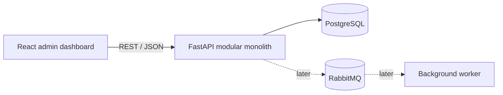

# StockFlow

StockFlow is a production-oriented inventory and warehouse management system. It is being built as a modular monolith so transactional inventory rules remain easy to reason about while feature boundaries stay explicit.

> Current delivery: **Milestone 1 — Foundation**

## What is included

- FastAPI service with a typed liveness endpoint and consistent error foundation
- Async SQLAlchemy and Alembic configuration for PostgreSQL
- React, TypeScript, Vite, Ant Design, React Router, TanStack Query, and Axios
- Responsive admin application shell with the complete planned navigation
- Docker development workflow for the frontend, backend, and PostgreSQL
- Backend and frontend smoke tests
- Architecture and workflow documentation for the planned domain

Domain CRUD, authentication, and inventory workflows are intentionally not implemented yet. The project plan introduces them one milestone at a time so each change can be migrated, tested, and documented.

## Architecture



Feature modules live under `backend/app/` and `frontend/src/features/`. HTTP routes validate inputs and delegate to services; services will own transactions and business rules. See [docs/architecture.md](docs/architecture.md).

## Repository layout

```text
.
├── backend/             FastAPI application, migrations, and tests
├── frontend/            React admin application and tests
├── docs/                Architecture and domain documentation
├── docker-compose.yml   Local development services
└── .env.example         Safe configuration template
```

## Quick start with Docker

Requirements: Docker Engine with Compose v2.

```bash
cp .env.example .env
docker compose up --build
```

Then open:

- Web app: http://localhost:5173
- API docs: http://localhost:8000/docs
- Health check: http://localhost:8000/api/health

Stop services with `docker compose down`. Add `-v` only when you intentionally want to delete local database data.

## Local development

The supported Python version is 3.11 or newer; containers currently use Python 3.12.

Backend:

```bash
cd backend
python -m venv .venv
source .venv/bin/activate
pip install -e '.[dev]'
alembic upgrade head
uvicorn app.main:app --reload
```

Frontend (Node.js 22 recommended):

```bash
cd frontend
npm ci
npm run dev
```

## Tests and quality checks

```bash
cd backend
ruff check .
mypy app
pytest

cd ../frontend
npm run lint
npm run test:run
npm run build
```

Or run the test suites in containers:

```bash
docker compose run --rm backend pytest
docker compose run --rm frontend npm run test:run
```

## Configuration

| Variable | Purpose | Development default |
| --- | --- | --- |
| `DATABASE_URL` | Async SQLAlchemy PostgreSQL URL | Docker Compose database |
| `POSTGRES_DB` | PostgreSQL database name | `stockflow` |
| `POSTGRES_USER` | PostgreSQL user | `stockflow` |
| `POSTGRES_PASSWORD` | PostgreSQL password | development-only value |
| `JWT_SECRET` | Signing secret reserved for Milestone 2 | development-only value |
| `CORS_ORIGINS` | Comma-separated allowed browser origins | local frontend origins |
| `RABBITMQ_URL` | Broker URL reserved for Milestone 9 | local RabbitMQ URL |
| `VITE_API_URL` | Browser-facing API base path | `/api` |

Copy `.env.example` to `.env` and replace secrets before any shared or production deployment.

## API documentation

FastAPI serves interactive Swagger UI at `/docs`, ReDoc at `/redoc`, and the OpenAPI schema at `/api/openapi.json`. Milestone 1 exposes `GET /api/health`.

## Roadmap

1. **Foundation** — repository, API, web shell, PostgreSQL, Docker, health checks
2. Authentication, users, login, protected routes
3. Product CRUD and product UI
4. Warehouses, inventory, receipts, adjustments
5. Transfers and stock movement audit history
6. Orders, reservations, cancellation, shipment
7. Suppliers and purchase orders
8. Concurrency protection and transaction tests
9. RabbitMQ, domain events, workers, low-stock events
10. Idempotency, retries, dead-letter queues, transactional outbox
11. Dashboards, reports, real-time notifications
12. CI/CD, expanded documentation, production hardening

## Design principles

- PostgreSQL and the backend are the source of truth for business rules.
- Available inventory is derived from on-hand minus reserved stock.
- Inventory changes are transactional and auditable.
- Alembic owns schema evolution; runtime auto-creation is not used.
- Messaging is added only after the synchronous core is correct.
