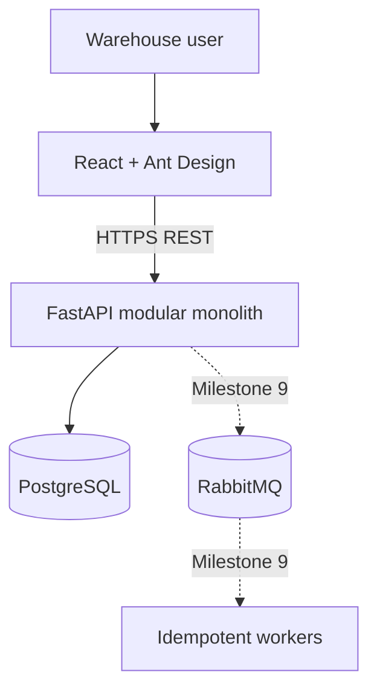
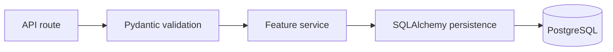

# Architecture

## Current delivery

Milestone 1 established the runnable vertical slice. Milestone 2 added identity and access control, Milestone 3 added the product catalog, Milestone 4 introduced warehouse inventory, and Milestone 5 completed transfers and movement history. Milestone 6 adds outbound orders whose reservation, release, and shipment transitions update inventory and audit movements in the same transaction.

## System context

## Backend boundaries

Each feature package will own its routes, schemas, service rules, and persistence models where practical. Shared technical code belongs in `core`; shared API behavior belongs in `common`.

Routes stay thin. Services define transaction boundaries for inventory workflows, and repositories centralize allowlisted sorting, aggregate queries, and locking reads. Inventory and order mutation services use PostgreSQL row locks and commit status, balance, and movement changes together. Transfers request locks in warehouse-ID order; multi-line orders request inventory locks in warehouse/product order.

## Frontend boundaries

Routes map to feature pages inside the shared application layout. Axios owns HTTP transport and TanStack Query owns server-state caching. Ant Design supplies standard interface primitives. Client-side rules improve usability but never authorize a domain transition.

## Key tradeoff: modular monolith first

A modular monolith provides one database transaction across orders and inventory, simple local operations, and fewer distributed failure modes. Feature packages preserve seams that could support later extraction, but extraction is not a goal until independent scaling or ownership demands it.
