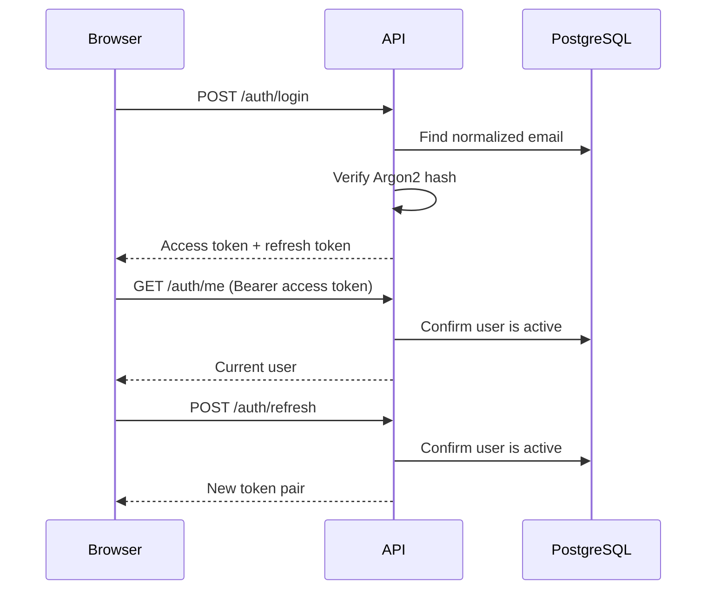

# Authentication and authorization

Milestone 2 introduces user identities, stateless JWT sessions, role enforcement, and admin user management.

## Endpoints

| Method | Path | Access | Purpose |
| --- | --- | --- | --- |
| `POST` | `/api/auth/register` | Public | Register an active employee account |
| `POST` | `/api/auth/login` | Public | Exchange credentials for a token pair |
| `POST` | `/api/auth/refresh` | Public with refresh token | Issue a new token pair |
| `GET` | `/api/auth/me` | Authenticated | Return the current user |
| `GET` | `/api/users` | Admin | Paginated user list |
| `GET` | `/api/users/{id}` | Admin | User details |
| `PATCH` | `/api/users/{id}` | Admin | Change name, role, or active state |

Registration never accepts a role from the client; new accounts are always `EMPLOYEE`. An optional administrator is created idempotently from `BOOTSTRAP_ADMIN_*` environment variables after migrations run.

## Session flow

Access tokens are short-lived and can only access protected endpoints. Refresh tokens cannot be used as bearer access tokens. Each request reloads the user so role changes and deactivation take effect without waiting for token expiry.

## Roles

- `ADMIN`: all current endpoints, including user administration.
- `WAREHOUSE_MANAGER`: reserved for product, warehouse, inventory, order, supplier, and purchase-order management in later milestones.
- `EMPLOYEE`: read and limited order access in later milestones.

The frontend hides or blocks unauthorized screens for usability. FastAPI dependencies enforce every permission independently and remain the source of truth.

## Security tradeoffs

Passwords use Argon2 through `pwdlib` and are never returned or logged. JWTs include subject, role, type, expiry, issued-at time, and a unique ID. Refreshing issues a fresh pair, but server-side revocation is not yet implemented; password changes and logout-all-sessions will require a token-version or revocation design.

The SPA currently stores tokens in browser local storage because the API returns bearer tokens directly. This keeps local Docker development simple but increases exposure if an XSS vulnerability exists. A hardened deployment should prefer an HttpOnly, Secure, SameSite refresh cookie, a memory-only access token, a strong content security policy, and explicit CSRF handling.

