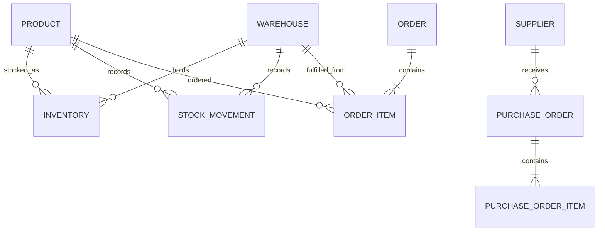

# Database

PostgreSQL is the sole transactional datastore. SQLAlchemy 2.x uses its async API through `asyncpg`; Alembic owns all schema changes.

## Milestone 1 state

The initial revision is an intentionally empty baseline. It proves migration execution is part of startup without introducing domain tables before their milestones.

## Planned relationships

The concrete schema and indexes will be documented alongside their migrations. Available quantity will be computed as `quantity_on_hand - quantity_reserved`, never stored.

## Migration policy

- Every schema change receives a reviewed Alembic revision.
- Production startup never calls ORM `create_all`.
- Downgrades should be safe when practical; destructive reversals require explicit operational review.
- Constraints protect invariants in addition to application validation.

