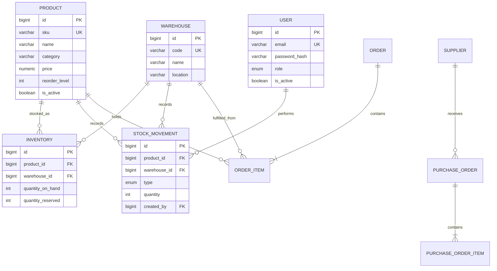

# Database

PostgreSQL is the sole transactional datastore. SQLAlchemy 2.x uses its async API through `asyncpg`; Alembic owns all schema changes.

## Current schema

The initial revision is an intentionally empty baseline. Milestone 2 adds `users` and the PostgreSQL `user_role` enum. Milestone 3 adds `products`. Milestone 4 adds `warehouses`, `inventory`, `stock_movements`, and the `stock_movement_type` enum. Emails are normalized to lowercase before persistence and protected by a unique constraint. Password hashes are stored, never plaintext passwords.

## Current inventory relationships

The `(product_id, warehouse_id)` inventory pair is unique. Database checks require on-hand and reserved quantities to remain non-negative and prevent reserved stock from exceeding on-hand stock. Available quantity is computed as `quantity_on_hand - quantity_reserved`, never stored.

## Migration policy

- Every schema change receives a reviewed Alembic revision.
- Production startup never calls ORM `create_all`.
- Downgrades should be safe when practical; destructive reversals require explicit operational review.
- Constraints protect invariants in addition to application validation.
