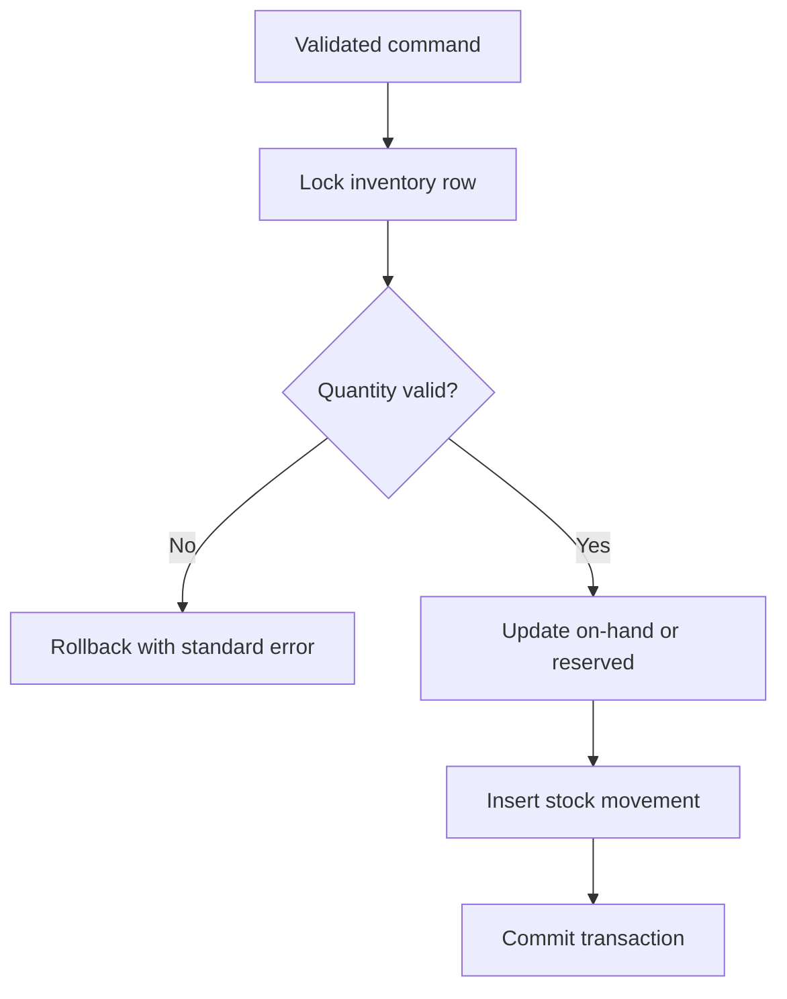

# Inventory flow

Inventory workflows begin in Milestone 4. This document records the target behavior so implementation can be reviewed against it.

Receipts, adjustments, reservations, releases, shipments, transfers, and returns must create audit movements. Transfers update both locations and create both movements within one database transaction. Row-level locks will prevent concurrent reservations from overselling.

