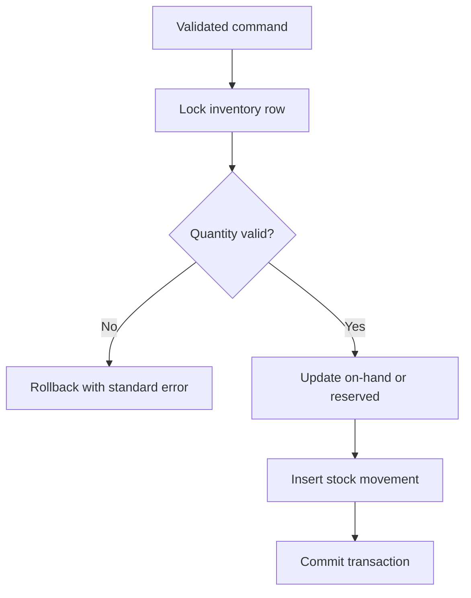
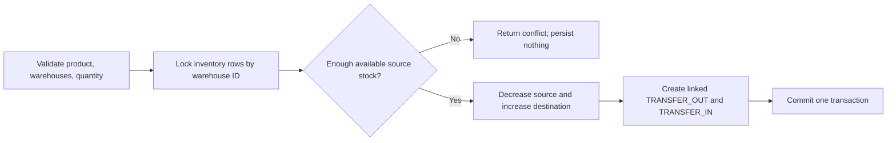

# Inventory flow

Milestone 4 implements receipts and reasoned adjustments through this transaction flow:

The service locks an existing `(product, warehouse)` balance with `SELECT ... FOR UPDATE`. The database additionally enforces non-negative on-hand and reserved quantities and ensures reserved quantity never exceeds on-hand quantity. A receipt or adjustment and its `StockMovement` audit row commit together or roll back together.

Milestone 5 extends the flow to two-sided transfers:

Reservations, releases, shipments, and returns join this same flow with the order lifecycle in Milestone 6.

Receipts, adjustments, reservations, releases, shipments, transfers, and returns must create audit movements. Transfers update both locations and create both movements within one database transaction. Row-level locks will prevent concurrent reservations from overselling.
