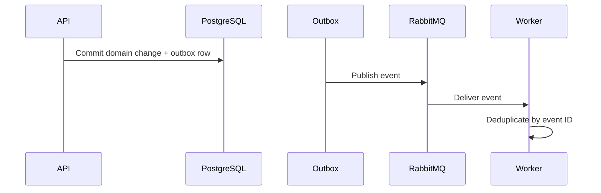

# Messaging

RabbitMQ is intentionally deferred until Milestone 9, after synchronous inventory and order transactions are covered by integration and concurrency tests.

Planned events include `order.created`, `order.confirmed`, `order.cancelled`, `order.shipped`, `stock.received`, `stock.reserved`, `stock.released`, `stock.transferred`, and `stock.low`.

Consumers will use stable event IDs for idempotency, bounded retries, dead-letter routing, and structured logs. Milestone 10 will evaluate a transactional outbox to close the database-commit/message-publish consistency gap.

