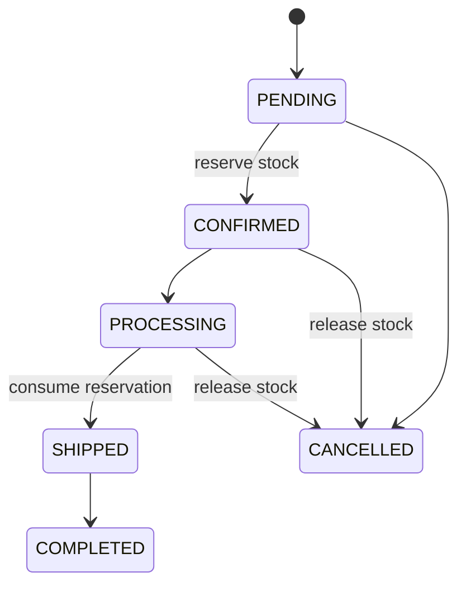

# Order flow

Order workflows begin in Milestone 6. The backend is the sole authority for state transitions.

Invalid transitions return a consistent conflict error. Confirmation locks affected inventory rows and reserves stock atomically. Cancellation releases reservations; shipment decreases both on-hand and reserved quantities.

