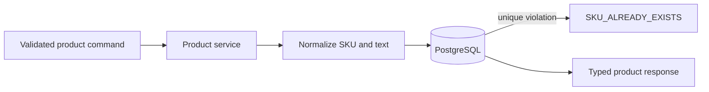

# Product management

Milestone 3 introduces the product catalog and its administrative interface.

## API

| Method | Path | Roles | Purpose |
| --- | --- | --- | --- |
| `POST` | `/api/products` | Admin, warehouse manager | Create a product |
| `GET` | `/api/products` | Any authenticated user | Search and list products |
| `GET` | `/api/products/categories` | Any authenticated user | List distinct categories |
| `GET` | `/api/products/{id}` | Any authenticated user | Product details |
| `PUT` | `/api/products/{id}` | Admin, warehouse manager | Update supplied fields |
| `DELETE` | `/api/products/{id}` | Admin, warehouse manager | Mark a product inactive |

The list endpoint accepts `page`, `page_size`, `search`, `category`, `is_active`, `sort_by`, and `sort_order`. Search matches SKU or name without case sensitivity. Sort fields are allow-listed by the API rather than interpolated from client input.

## Invariants

- SKUs are trimmed, converted to uppercase, and unique.
- Prices use PostgreSQL `NUMERIC(12, 2)` and cannot be negative.
- Reorder levels are whole numbers and cannot be negative.
- Required text is trimmed before persistence.
- Deletion sets `is_active` to false so future inventory and audit references remain valid.
- Database constraints duplicate critical numeric and uniqueness validation.

## Frontend

The products screen uses TanStack Query for all server state. Search, filters, sorting, and pagination produce a new query key. Successful create, update, and deactivate mutations invalidate product and category queries. Employees receive a read-only interface; mutation controls are shown only for managers and administrators, while the API independently enforces the same rules.

Product details now show live inventory by warehouse. Stock movement history remains a deliberate placeholder until Milestone 5 exposes the movement query API.
